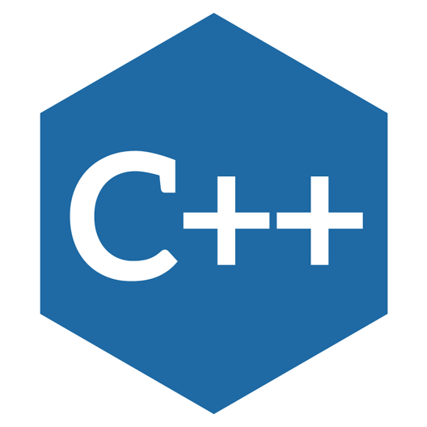
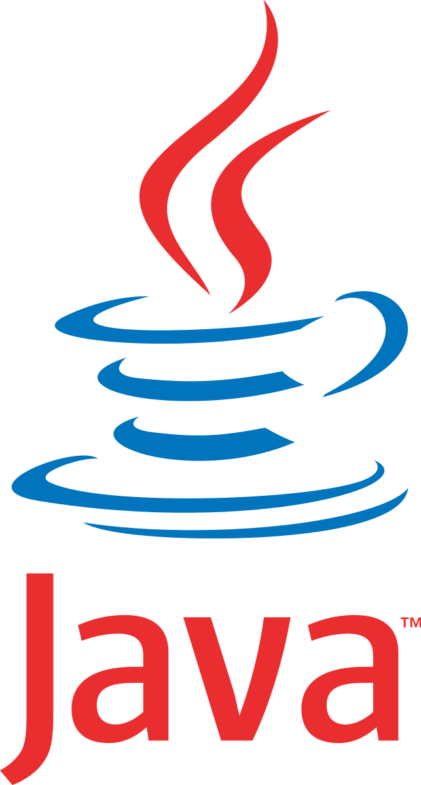
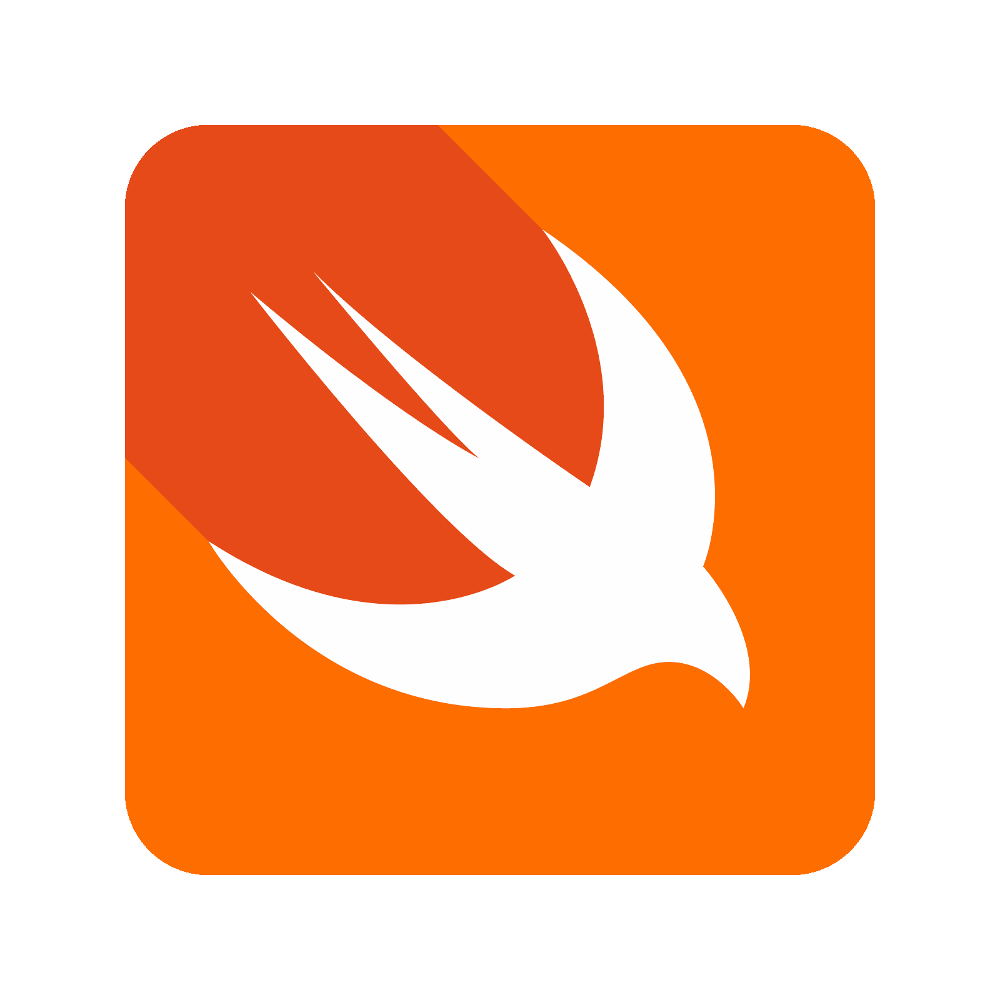

#  Maria Eduarda

**`Desenvolvedora de Software`**

Me chamo Maria Eduarda, tenho 22 anos e sou de Goiânia. Tenho paixão por desafios de lógica, jogos e computação como um todo. Agora, acredito que a solução de problemas irá me acompanhar em todos os campos que meu pensamento tocar.

---

## O que venho fazendo

- Cursando Sistemas de Informação na UFU, no 8º período
- Projetos em Mobile (Android/Kotlin, iOS/Swift), Sistemas Distribuídos e Desenvolvimento Web
- Já passei por hackathons, maratonas de programação e monitorias; Ensinar também me ajuda a aprender melhor!
- Pesquisa de Iniciação Científica sobre como o Sistema Operacional afeta a eficiência de modelos de ML aplicados à detecção de Malware

###  Linguagens e Tecnologias

 

 
 

### 📊 Estatísticas

  

